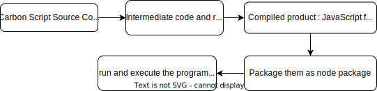

# Carbon Script Compiler

## Introduction

This project implements the compiler of Carbon Script. Taking Carbon Script as a source language and JavaScript as the target language. The final compilation product is the JavaScript file that can run on the Nodejs platform.

In addition to the compiler, this project also comes with a packing program. It packs the compiled JavaScript file into a Node package, which can run this program through the package management command.

## Documentation

The official document address is here:([CarbonScript Documentation](https://carbonscript.github.io/)). This document provides the learning materials of Carbon Script and the usage of the compiler to tell you how to create projects, write code, generate programs, and run programs. Most problems can be found here.

## Contributing

Pull requests are welcome. For major changes, please open an issue first to discuss what you would like to change.

## License

This project uses the **MIT** license.
